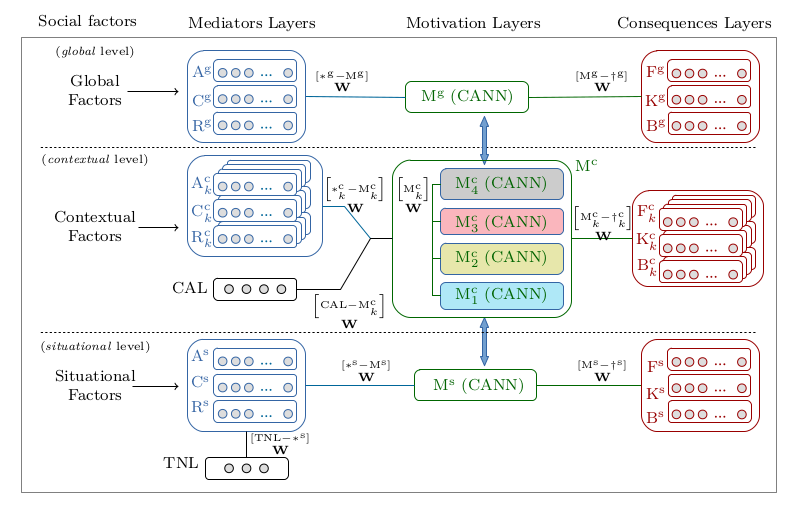
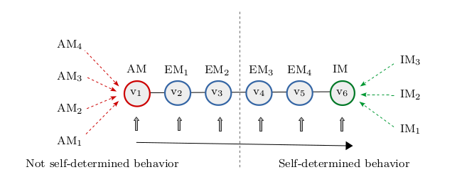

# The Dinamic Computational Model of Motivation (DCMM)

The hierarchical model of *intrinsic and extrinsic motivation* (HMIEM) is a framework based on the principles of *self-determination theory* (SDT) which describes human motivation from a multilevel perspective, and integrates knowledge on personality and social psychological determinants of motivation and its consequences. Although over the last decades HMIEM has grounded numerous correlational studies in diverse fields, it is conceptually defined as a schematic representation of the dynamics of motivation, that is not suitable for human and artificial motivation research based on tracking. In this work we propose an analytic description named *dynamic computational model of motivation* (DCMM), inspired by HMIEM and based on *continuous attractor neural networks*, which consists in a computational framework of motivation. In DCMM the motivation state is represented within a self-determination continuum with recurrent feedback connections, receiving inputs from heterogeneous layers. Through simulations we show the modeling of complete scenarios in DCMM. A field study with faculty subjects ilustrates how DCMM can be provided with data from SDT constructs measures. We believe that DCMM is relevant for investigating unresolved issues in HMIEM, and an interesting framework for related fields, including psychology, artificial intelligence, behavioral and developmental robotics, and educational technology.

## Project content 

In this repository you will find the GNU Octave implementation of the framework proposed for the simulations and the field case studies.

## Instructions

All that is required to do is to run the main scripts *cs1.m*, *cs2.m*, and *cs3.m* to execute the three case studies reported in the paper. Each of these scripts are self contained, so the complete model parametrization can be observed. Auxilliary scripts are provided to set the model weight matrices analitically, they are saved in folder named *parameters*. The plots generated are saved in *eps* format in the folder named *plots*, data from plots is also sabed in *csv* format. Data from the SDT measures considered in CS3 are located in folder named *measures*.

The algorithms were developed and tested in GNU Octave 4.0.2, running in the operative system Ubuntu 16.04. 

## Work reference

For more details about the model, please consult the original reference:

H. F. Chame, F. P. Mota, S. S. C. Botelho (2018) **A dynamic computational model of motivation based on self-determination theory and CANN** *Information Sciences*, Elsevier. doi: [https://doi.org/10.1016/j.ins.2018.09.055](https://www.sciencedirect.com/science/article/pii/S0020025518307679)
